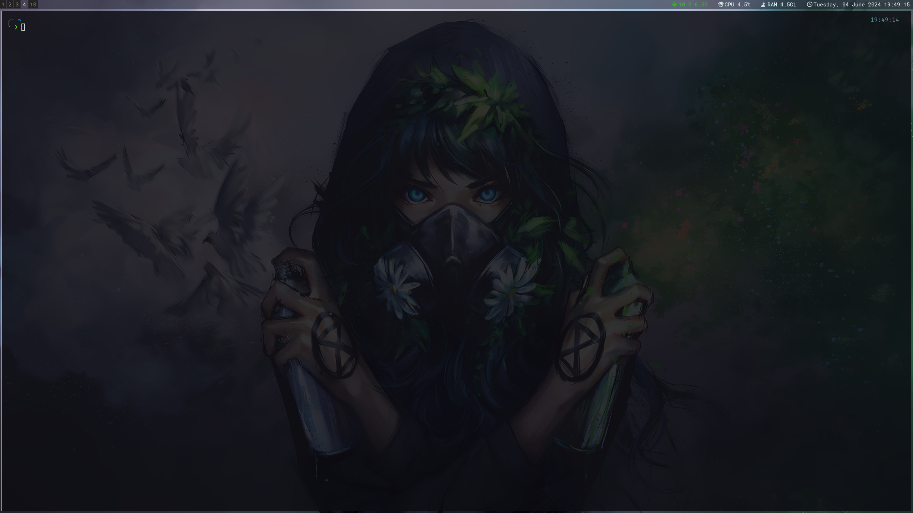

# My dotfiles (Arch Linux)
To install, just git clone the repository and run "./install.sh"

## HUD Gadgets
- [x] i3-gaps
- [x] i3-bar
- [x] Picom
- [x] Rofi

## Preview

### References
- [xct kali-clean](https://github.com/xct/kali-clean)
- [i3blocks scripts](https://github.com/vivien/i3blocks)
